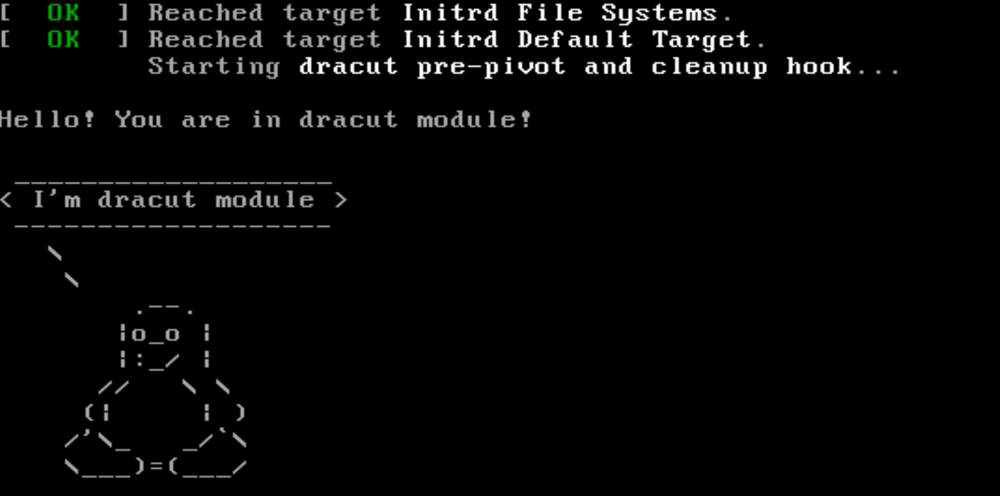

### 1. Загрузка в систему под root-ом без пароля
#### Ифнормация о системе
Действия выполнялись в **Ubunut 20.04**:
виртуальная машина **VirtualBox**, созданная с помощью **Vagrant** (Vagrantfile находится в текущей папке репозитория).  

Начальные значения параметров загрузки ядра:

#### Способ 1.1 - init=/bin/bash
Меняем параметры загрузки ядра в GRUB:
1. В строке **linux** меняем "ro console=tty1 console=ttyS0" на "rw init=/bin/bash":  

2. Нажимаем **Ctrl+x** (или **F10**), чтобы продолжить загрузку с новыми значениями параметров

Загрузка системы завершается открытием оболочки **bash** под пользователем **root** (корневая файловая система подмонтирована в режиме "чтение-запись"):

#### Способ 1.2 - init=/bin/sh (командная оболочка GRUB)
1. Загружаем систему, выполнив команды в командной оболочке GRUB
(для перехода в командную оболочку GRUB надо нажать "**с**", находясь в меню GRUB)
2. В строке **linux** указываем "**rw init=/bin/sh**"

Загрузка системы завершается открытием оболочки **bash** под пользователем **root**:

#### Способ 2 - init=/sysroot/bin/sh

Аналогично способу **1.1** в строку **linux**  добавляем опцию "**rw init=/sysroot/bin/sh**":

Как альтернатива, можно указать опцию **rw init=/sysroot/bin/sh** при загрузке из командной оболочки GRUB:

Данный способ **не сработал**. Загрузка системы заканчивается окном приглашения ввести логин-пароль

#### Способ 3 - rd.break

Аналогично способу **1.1** в строку **linux** добавляем опцию **rd.break**:

Как альтернатива, можно указать опцию **rd.break** при загрузке из командной оболочки GRUB:

Данный способ **не сработал**. Загрузка системы заканчивается окном приглашения ввести логин-пароль

---
### 2. Переименовать VG в системе с LVM

#### Ифнормация о системе
Действия выполнялись в **Ubunut 20.04**:
виртуальная машина **VirtualBox**, созданная с помощью **Vagrant** из бокса с установленным LVM (Vagrantfile находится в подпапке **LVM_task**).  

#### Порядок действий

1. Посмотреть текущее название VG через **vgs**
2. Выполнить переименование с помощью **vgrename**

3. Отредактировать файлы /etc/fstab, /etc/default/grub, /boot/grub/grub.cfg 
   фактически потребовалось в **/boot/grub/grub.cfg** поменять **/dev/mapper/ubuntu--vg-ubuntu--lv** на **/dev/mapper/OtusRoot-ubuntu--lv** (всего 3 вхождения)

4. В завершении пересоздать файл **initrd.img-$(uname -r)** в каталоге **/boot**:

Результат команды vgs после перезагрузки системы:

---
### 3. Добавление модуля в initrd

1. Создать папку **/usr/lib/dracut/modules.d/01test**
2. Скопировать в эту папку bash-скрипты из папки /vagrant (**test.sh** и **module-setup.sh**)
   bash-скрипты доступны в папке **data**
3. Пересобрать **initrd.img-$(uname -r)** в каталоге /boot (например, **sudo dracut -v -f**)
   
   В данном случае, **dracut** отсутствовал в системе.
   Образ **initrd.img** был пересобран
   автоматически при установке с помощью 
   **$ sudo apt install dracut -y**
4. Перезагрузить систему
   Предварительно убрать параметр загрузки **quiet** (в **/etc/default/grub** или в параметрах загрузки из меню GRUB)

Результат:

